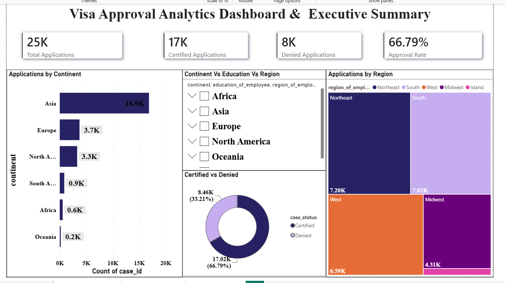
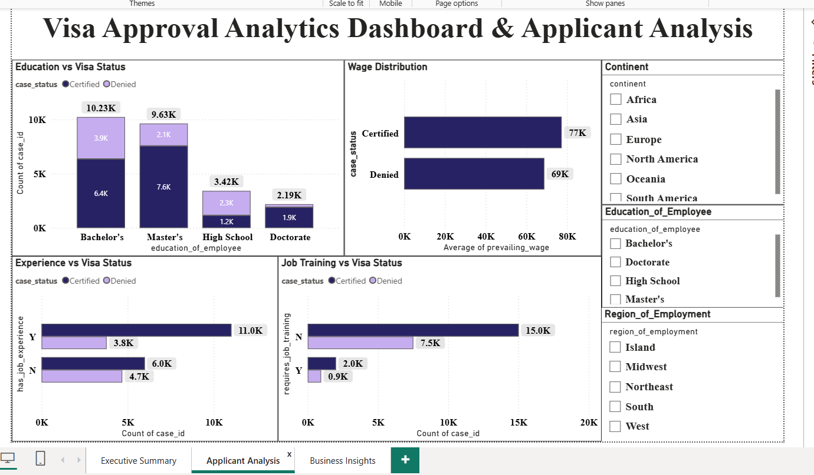
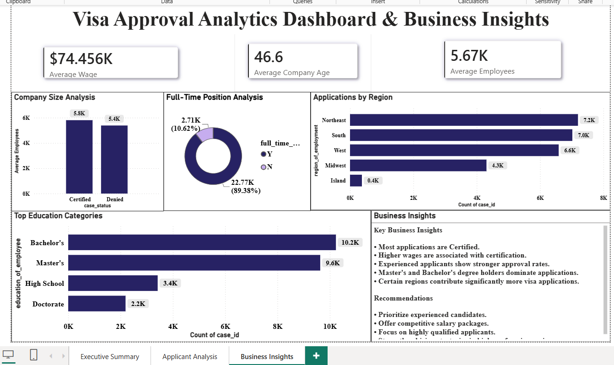

# 📊 Visa Approval Analytics Dashboard

<div align="center">

### 🚀 End-to-End Data Analytics Project

**Python | SQL Server | Machine Learning | Power BI**

Analyzing visa application data to uncover approval trends, business insights, and predictive patterns.

</div>

---

# 🎯 Project Objective

The goal of this project is to analyze visa application data and identify the key factors that influence visa approval (Certified) and denial outcomes.

This project demonstrates a complete Data Analytics workflow including:

✅ Data Understanding  
✅ Data Cleaning  
✅ Exploratory Data Analysis (EDA)  
✅ SQL Analysis  
✅ Machine Learning  
✅ Power BI Dashboard Development  
✅ Business Insights & Recommendations

---

# 📂 Dataset Overview

| Metric | Value |
|----------|----------|
| Total Records | 25,480 |
| Total Features | 12 |
| Target Variable | case_status |
| Classes | Certified, Denied |

---

# 🛠️ Tech Stack

### Programming & Analysis

- 🐍 Python
- 📊 Pandas
- 🔢 NumPy
- 📈 Matplotlib
- 🎨 Seaborn

### Machine Learning

- 🤖 Scikit-Learn
- 🌲 Decision Tree
- 🌳 Random Forest
- 📉 Logistic Regression

### Database

- 🗄️ SQL Server
- 📝 SQL Queries

### Dashboarding

- 📊 Power BI

### Version Control

- 🔗 Git
- 🐙 GitHub

---

# 🔄 Project Workflow

```text
Raw Data
   ↓
Data Understanding
   ↓
Data Cleaning
   ↓
Exploratory Data Analysis
   ↓
SQL Analysis
   ↓
Machine Learning
   ↓
Power BI Dashboard
   ↓
Business Insights
```

---

# 📊 Exploratory Data Analysis (EDA)

Key analyses performed:

### 🎓 Education Analysis

- Bachelor's degree holders submitted the highest number of applications.
- Master's degree holders showed strong certification rates.

### 💰 Wage Analysis

- Certified applications generally had higher prevailing wages.

### 👨‍💼 Experience Analysis

- Applicants with prior work experience had higher approval rates.

### 🌎 Region Analysis

- Northeast and South regions generated the highest number of applications.

---

# 🗄️ SQL Analysis

Performed SQL queries to analyze:

✅ Visa Approval Distribution

✅ Region-wise Applications

✅ Education-wise Applications

✅ Average Wage Analysis

✅ Experience Analysis

✅ Certification Rates

---

# 🤖 Machine Learning Models

The following classification models were trained and evaluated:

| Model | Purpose |
|---------|---------|
| Logistic Regression | Baseline Model |
| Decision Tree | Rule-Based Classification |
| Random Forest | Ensemble Learning |

### Evaluation Metrics

- Accuracy
- Precision
- Recall
- F1 Score

---

# 📈 Power BI Dashboard

## 📌 Executive Summary

- Total Applications
- Certified Applications
- Denied Applications
- Approval Rate
- Continent Analysis
- Region Analysis

---

## 📌 Applicant Analysis

- Education vs Visa Status
- Experience vs Visa Status
- Job Training Analysis
- Wage Analysis

---

## 📌 Business Insights

- Company Size Analysis
- Full-Time Position Analysis
- Regional Analysis
- Strategic Recommendations

---

# 📸 Dashboard Screenshots

## Executive Summary



---

## Applicant Analysis



---

## Business Insights



---

# 🔍 Key Findings

### 📌 Approval Trends

- Most visa applications were Certified.
- Certified applications significantly outnumbered denied applications.

### 📌 Salary Impact

- Higher prevailing wages were associated with higher certification rates.

### 📌 Education Impact

- Bachelor's and Master's degree holders dominated visa applications.

### 📌 Experience Impact

- Experienced applicants showed stronger approval rates.

### 📌 Regional Impact

- Northeast and South regions generated the highest application volume.

---

# 💡 Business Recommendations

✅ Prioritize experienced candidates

✅ Offer competitive salary packages

✅ Focus on highly qualified applicants

✅ Improve hiring strategies in high-performing regions

✅ Strengthen workforce planning based on approval trends

---

# 📁 Project Structure

```text
Visa-Approval-Analytics/
│
├── notebooks/
│   ├── 01_Data_Understanding.ipynb
│   ├── 02_Data_Cleaning.ipynb
│   ├── 03_EDA.ipynb
│   └── 04_Prediction_Model.ipynb
│
├── sql/
│   └── visa_analysis.sql
│
├── dashboard/
│   └── Visa_Approval_Dashboard.pbix
│
├── screenshots/
│   ├── executive_summary.png
│   ├── applicant_analysis.png
│   └── business_insights.png
│
├── reports/
│   └── business_insights.md
│
├── README.md
└── requirements.txt
```

---

# 👨‍💻 Author

## Prathamesh Shriwas

📊 Aspiring Data Analyst

💻 Python | SQL | Power BI | Machine Learning

🚀 Passionate about transforming data into actionable insights

---

# ⭐ If you found this project useful

Please consider giving it a ⭐ on GitHub!
